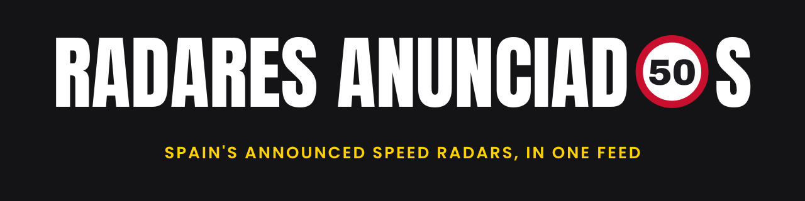

<p align="center">
  
</p>

<h1 align="center">Radares Anunciados</h1>

<p align="center">
  <a href="https://github.com/GeiserX/radares-anunciados/actions/workflows/ci.yml"></a>
  <a href="LICENSE"></a>
</p>

Radares Anunciados is an iPhone app that warns a driver before the speed radars announced in Spain: the DGT's fixed and section radars, its mobile-radar stretches, the weekly lists of local police and OpenStreetMap. It speaks the warning through the car's audio and posts it as a Time Sensitive notification, with the phone locked in a pocket and the app not opened that day.

## Features

- Spoken warning once per radar, at a distance that grows with speed (347 m at 50 km/h, 833 m at 120 km/h).
- Only radars ahead and in your direction of travel; a radar for the other carriageway is shown, not spoken.
- Mobile-radar and average-speed stretches with the remaining distance, and "Fin de tramo" at the end.
- Every warning is also a Time Sensitive notification on the phone, drawn by iOS; nothing to open, nothing to leave on screen.
- In a CarPlay car the warning shows on the car screen too (iOS 18.4 or later, the app is a CarPlay driving-task app).
- Starts on its own when you drive, like a notification app: iOS wakes it when the car moves.
- Works offline: the radar list is on the phone, refreshed every 6 hours, with a copy bundled for the first drive.
- An Estado screen that checks every link of the chain, and a "Probar aviso" button that runs a test warning through it.
- No account, no server, no ads, no tracking. Spanish and English.

## Quick start

A TestFlight beta is coming with the first build; the link will be here. The app needs an iPhone with iOS 18 or later.

To build it yourself on a Mac with Xcode 26 and [XcodeGen](https://github.com/yonaskolb/XcodeGen):

```bash
git clone https://github.com/GeiserX/radares-anunciados && cd radares-anunciados
swift test                                   # the RadaresCore package
xcodegen generate --spec App/project.yml && open App/RadaresAnunciados.xcodeproj
```

On first launch the app walks you through three screens: location (allow "Always" and Precise Location), notifications and Motion, and Estado.

## How it works

1. When the car starts moving, Apple's significant-change and region services wake the app; a GPS probe confirms you are driving.
2. While you drive, one fix a second goes through the alert engine in `RadaresCore`, a Swift package with no platform code.
3. A radar fires when it is ahead, you are closing on it, it is within 25 seconds of driving (300 m to 1 km), and its direction matches yours.
4. The warning goes out by voice and as a Time Sensitive notification, each one logged with its outcome.
5. When you stop for good the app ends the drive, re-arms a 400 m fence around where you parked, and goes back to sleep without GPS.
6. The radar list comes from the public feed of [radares-anunciados-ha](https://github.com/GeiserX/radares-anunciados-ha), checked and replaced atomically.

## Data, privacy and the law

The app warns from published positions only. Spain's Reglamento General de Circulación, [art. 18.3](https://www.boe.es/buscar/act.php?id=BOE-A-2003-23514#a18), bans radar detectors and jammers and leaves out of that ban "los mecanismos de aviso que informan de la posición de los sistemas de vigilancia del tráfico". The app never senses, receives or interferes with a radar signal. Respect the speed limits.

Sources and licences: DGT (CC BY 4.0), the local police weekly lists of León (ILEÓN, CC BY-NC 4.0) and Murcia (La Opinión de Murcia), and © OpenStreetMap contributors (ODbL 1.0); the database is under ODbL 1.0. Every radar keeps its source's attribution, and the app shows them on its sources screen. See [NOTICE](NOTICE).

Your location never leaves the phone; the only network request is the download of the public radar list. Details in [PRIVACY.md](PRIVACY.md).

## Releasing

`.github/workflows/release.yml` archives and uploads to TestFlight on a `vX.Y.Z` tag that matches `MARKETING_VERSION` in `App/project.yml`. Before tagging, bump `CURRENT_PROJECT_VERSION` (every upload needs a higher one) and refresh the bundled feed with `scripts/update-snapshot.sh` if it is older than 30 days. The workflow needs:

- Six repository secrets: `APPSTORE_ISSUER_ID`, `APPSTORE_KEY_ID`, `APPSTORE_PRIVATE_KEY` (an App Store Connect API key with App Manager access), `DIST_CERTIFICATE_P12` and `DIST_CERTIFICATE_PASSWORD` (the Apple Distribution certificate, base64), and `PROFILE_APP` (the provisioning profile, base64).
- One App Store provisioning profile named exactly `Radares App Store` (App ID `io.github.geiserx.radares`).
- The App ID must have the **Time Sensitive Notifications** and **CarPlay Driving Task** capabilities enabled before the profile is generated: `App/project.yml` writes `com.apple.developer.usernotifications.time-sensitive` and `com.apple.developer.carplay-driving-task` into the entitlements, and `xcodebuild archive` fails with "doesn't include the … capability" against a profile made without them. Regenerate and re-upload `PROFILE_APP` after enabling them, and again at every profile renewal.

## Documentation

- [Design](docs/DESIGN.md): the alert model, location strategy, surfaces, data and health checks
- [Spec](docs/SPEC.md): the platform-neutral rules and the route vectors, the contract for Android
- [Device verification](docs/VERIFY.md): what only a real iPhone and a real drive can prove
- [CarPlay](docs/CARPLAY.md): the driving-task scene, the notification on the car screen and its rules
- [Contributing](CONTRIBUTING.md) and [Security](SECURITY.md)

## License

[GPL-3.0-or-later](LICENSE). An additional permission for App Store distribution is proposed in [NOTICE](NOTICE).
